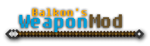

# Balkon's WeaponMod: Legacy



[](https://github.com/ThexXTURBOXx/Balkons-WeaponMod-Legacy/blob/1.21/LICENSE)
[](https://github.com/ThexXTURBOXx/Balkons-WeaponMod-Legacy/actions/workflows/build.yml)
[](https://www.curseforge.com/minecraft/mc-mods/balkons-flintlock-legacy)
[](https://modrinth.com/mod/balkons-flintlock-legacy)
[](https://crowdin.com/project/balkons-flintlock-legacy)
[](https://github.com/sponsors/ThexXTURBOXx)

Balkon's WeaponMod, a Minecraft mod about weapons.  
This is [HyperSpeeed](https://nmexis.me/)'s modernisation fork of
the [original project](https://github.com/Ckathode/balkons-flintlock).

## Why?

Rest in Pieces, Balkon's WeaponMod!  
This project is meant as a homage to our good old friend: Balkon's WeaponMod.  
Ten years ago (at the time of writing this it is mid-2024), the mod was abandoned.  
There were a few attempts to revive it, some of which were unofficial (mostly direct ports), some were rewrites such
as [Reforged](https://www.curseforge.com/minecraft/mc-mods/reforged).  
As one of the two creators of Reforged, I wanted to pose a challenge to myself:  
Directly port this gem of a mod to modern versions of Minecraft.

It is currently the 8th June 2024, and I started this whole endeavour on the 17th February 2024.  
Yes, it took a bit more than 4 months to finish this port.  
I am working full-time, so I can only dedicate a bit of my precious time to projects like this.  
I hope you enjoy playing around with it!

Without anything further to say here, enjoy!

## Contributing

There are many ways to contribute!

### Development

Development should be rather easy. BWM: Legacy currently uses Loom in three different flavors:

- [Architectury Loom](https://github.com/architectury/architectury-loom) for everything above 1.16.5. It is the easiest
  way to enable multi-platform modding and is officially endorsed by
  the [Architectury API](https://github.com/architectury/architectury) (which this mod depends on in 1.16.5+).
- [Essential Loom](https://github.com/EssentialGG/architectury-loom) for all versions between 1.8.9 and 1.12.2. Sadly,
  Architectury Loom does not officially support Minecraft versions that old. So,
  the [Essential team](https://github.com/EssentialGG) added many fixes to Architectury Loom to support these legacy
  versions.
- [My own Loom](https://github.com/ThexXTURBOXx/architectury-loom/tree/dev/1.6-1.7.10) for everything between and below.
  Sadly, even Essential Loom is not even able to handle some of these other versions correctly. So, I forked it and
  hence created a fourth fork layer of the official Loom - perfect! I added fixes and hacks to make Loom even
  1.7.10-compatible and fixed a few additional bugs that I found in upstream versions; that's all.

This way, you don't have to worry about most of the background tasks.  
If you want to change the mod's code, you can just do the following:

1. Clone the repo: `git clone https://github.com/ThexXTURBOXx/Balkons-WeaponMod-Legacy.git`
2. Checkout the branch you want to work on, e.g., `git checkout 1.7.10`
3. Open `build.gradle` or `build.gradle.kts` (depending on which version you want to develop on) in your favorite IDE (I
   am using IntelliJ IDEA and everything works fine here... Don't know about other IDEs, though!)
4. Your IDE should download and build some stuff. This might take quite some time...
5. Now, you should be able to change the code properly!

To test your changes, you can just do the following:

1. Run `gradlew build` to compile the mod
2. If everything worked fine, you should find the mod jar in either `build/libs/flintlock-forge-1.20.0.jar`
   or `<PLATFORM>/build/libs/flintlock-<PLATFORM>-1.20.0.jar`

When you are done with your changes, push them to
a [fork](https://github.com/ThexXTURBOXx/Balkons-WeaponMod-Legacy/fork) of my repository
and [open a PR](https://github.com/ThexXTURBOXx/Balkons-WeaponMod-Legacy/compare/1.21...Danmccool:Balkons-WeaponMod-Legacy:1.21)!  
**Make sure to target my repository, not the upstream (original) Balkon's WeaponMod repository!**

### Translation

This project uses [Crowdin](https://crowdin.com/project/balkons-flintlock-legacy)!  
If you want to translate the mod, feel free to change one of the existing languages there!  
If you want to translate the mod to another language that I have not yet added there,
please [open an issue](https://github.com/ThexXTURBOXx/Balkons-WeaponMod-Legacy/issues/new) to ask me to add it there
first.

### Bug Reports and Feature Requests

If you find a bug or want to see something new in the mod, feel free to let me know by
[opening an issue](https://github.com/ThexXTURBOXx/Balkons-WeaponMod-Legacy/issues/new)!

## Using the "API"

I have not changed the original "API" per-se. This comes with pros and cons.  
A big advantage is that any mod author can just re-enable the exact same code as back when he used the API and it should
still work!  
The big disadvantage is that the "API" is really ugly. The original author had better plans, but they were never
published. Hence, they collected dust
in [their own branch](https://github.com/ThexXTURBOXx/Balkons-WeaponMod-Legacy/tree/material_api).

### The API

Anyway, enough about the history... Here is an example of how the "API" could be used:

```java
public class BWMLegacyIntegration {

    // 5 is the ID of Netherite, so we need to start labelling at 6.
    // In your mod, it should be best to make these IDs configurable for the user.
    // Alternatively, use the `ordinal()` method of the material.
    // This way, you will avoid conflicts with other mods.
    public static final int COPPER_ID = 6;
    public static final int TIN_ID = 7;

    public static void init() {
        MaterialRegistry.registerCustomProjectileMaterial(new ICustomProjectileMaterials() {
            @Override
            public int[] getAllMaterialIDs() {
                // Here we return all the material IDs that we will handle
                return new int[]{COPPER_ID, TIN_ID};
            }

            @Override
            public int getMaterialID(ItemStack itemStack) {
                // This `if`-check should be optional, but I would suggest leaving this here anyway!
                if (itemStack != null && itemStack.getItem() instanceof IItemWeapon weapon && weapon.getMeleeComponent() != null) {
                    // Here we somehow identify the given ItemStack's item tier and return its ID
                    if (weapon.getMeleeComponent().weaponMaterial == ModItemTiers.COPPER) return COPPER_ID;
                    if (weapon.getMeleeComponent().weaponMaterial == ModItemTiers.TIN) return TIN_ID;
                }
                return -1;
            }

            @Override
            public float[] getColorFromMaterialID(int i) {
                // Some entities of BWM: Legacy can change their color.
                // The color for the given item tier must be returned as
                // {R,G,B}, where each value is between 0 and 1.
                if (i == COPPER_ID) return new float[]{0.86f, 0.65f, 0.25f};
                if (i == TIN_ID) return new float[]{0.50f, 0.50f, 0.50f};
                return null;
            }
        });
    }

}
```

This will make BWM: Legacy aware about the modded item tiers `COPPER` and `TIN`.  
You can also just add a single one or more than that, of course!  
The registration can happen at any point - during world load, during the start, doesn't matter!  
You can register the weapons for your custom item tier just like any other item.

### Depending on the mod

I would suggest using either [CurseMaven](https://www.cursemaven.com/) or the official
[CurseForge Maven API](https://support.curseforge.com/en/support/solutions/articles/9000197321-curseforge-api#Maven)
for that.

### Full example

As an example, I have fully implemented Bronze Boomerangs in the Bronze Fabric mod, as
seen [here](https://github.com/ThexXTURBOXx/bronze/commit/e2d792b15da0b6c5a27bc71f5301eb795ce8e133).

## Resource packs and patches

Below is a list of all the resource packs and patches for this mod I know of.  
If you know of one that I forgot, feel free
to [open an issue](https://github.com/ThexXTURBOXx/Balkons-WeaponMod-Legacy/issues/new) and let me know!

| Resource Pack          | Patch link                                                           |
|:-----------------------|:---------------------------------------------------------------------|
| Balkon's Gets Reforged | <https://modrinth.com/resourcepack/balkons-gets-reforged>            |
| Balkon's Revised       | <https://github.com/ThexXTURBOXx/Balkons-WeaponMod-Legacy/issues/52> |
| Sphax BDCraft          | <https://bdcraft.net/community/viewtopic.php?t=222>                  |

---


